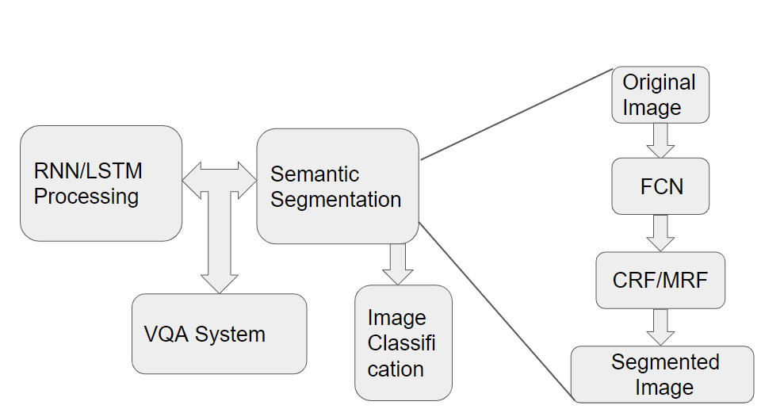

## Architecture

FCN: Fully Convolutional Networks for Semantic Segmentation
CRF: Conditional Random Field
MRF: Markov random field

  

The front end uses FCN for rough feature extraction, and the back end uses CRF/MRF to optimize the output of the front end, and finally the segmentation map is obtained.
Next, we will summarize from the front-end and back-end parts.

## FCN

The network we use for classification usually connects several fully connected layers at the end. It squashes the original two-dimensional matrix (picture) into one-dimensional, thus losing spatial information, and finally trains to output a scalar. This is our classification result.
The output of image semantic segmentation needs to be a segmentation map, regardless of size, but at least two-dimensional. Therefore, we need to discard the fully connected layer and replace it with a fully convolutional layer, and this is a fully convolutional network.

### Convolutional

Convolution is to place ordinary classification networks, some VGG16, ResNet50/101 and other networks in fully connected layers, and replace them with corresponding convolutional layer.

  

### Upsample (Deconvolution)

Deconvolution is similar to convolution, both are operations of multiplication and addition. It's just that the latter is many-to-one, and the former is one-to-many. For the forward and backward propagation of deconvolution, only the forward and backward propagation of convolution can be reversed.

  

### Skip Layer

The function of this structure is to optimize the result, because if the result after full convolution is directly up-sampled, the result is very rough, so the results of different pooling layers must be up-sampled to optimize the output.

  

The results obtained by different upsampling structures are compared as follows:

  

## CRF
CRF is referred as Conditional Random Field, which is the most common-used back-end algorithm.

  

The reason we need back-end algorithms is that convolutional network only output the value of each pixel independently, which don't care about the relationship between different pixels. So the using of CRF is to validate the edges of objects and make the areas smoothly.

  

where p denotes position and I denotes color embeddings.

  

### Reproduce
Using 5 iterations of CRF

  
  

  
  

  
  

## DeepLab

## Sprint3
1. Identify which area is background

2. Try to use more classification types

3. Combine the results from FCN and CRF, like deeplab
