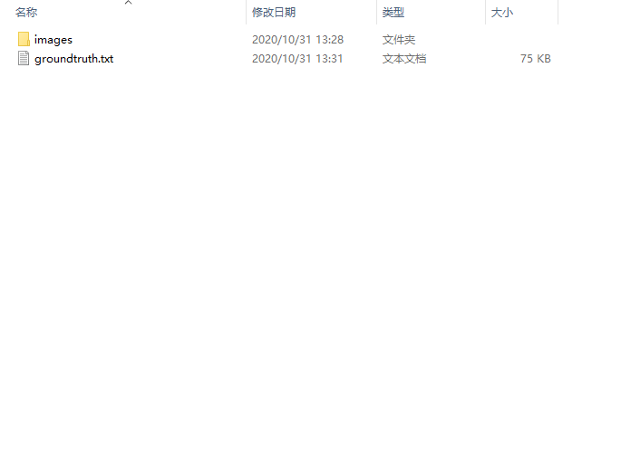

## Dataset
We selet more than 2000 pictures from original vqa dataset 7w to build this dataset.

  

There are images and also to train the models we need the groundtruth.

Almost half of the two pictures above is sky. But when asking for the background, it doesn't make any sense to say it's sky. The background of them should be buildings and grass.

