# Sprint3
## Dataset
We selet more than 2000 pictures from original vqa dataset 7w to build this dataset.

  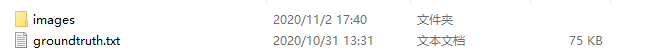

There are images and also to train the models we need the groundtruth.

  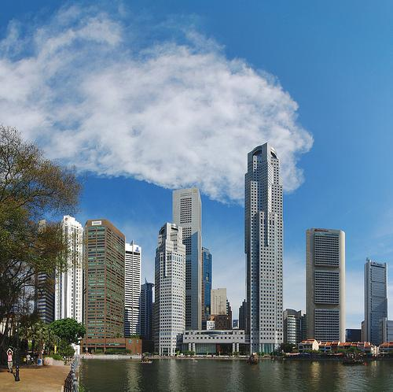
  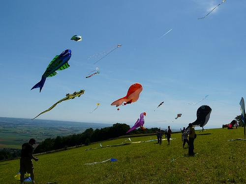

Almost half of the two pictures above is sky. But when asking for the background, it doesn't make any sense to say it's sky. The background of them should be buildings and grass.

  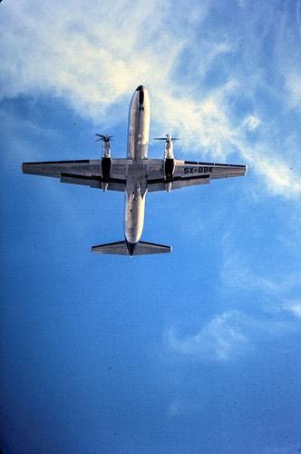

## LSTM

We need to extract features from the image and combine it with the features extracted from the image to generate the answer.For text features, technologies such as Bag-Of-Words (BOW) or Long Short Term Memory (LSTM) encoders can be used.

LSTM is a special kind of RNN, capable of learning long-term dependencies. LSTMs are explicitly designed to avoid the long-term dependency problem. Remembering information for long periods of time is practically their default behavior, not something they struggle to learn.

All recurrent neural networks have the form of a chain of repeating modules of neural network. In standard RNNs, this repeating module will have a very simple structure.

 
 

The repeating module in a standard RNN contains a single layer.
 
LSTMs also have this chain like structure, but the repeating module has a different structure. Instead of having a single neural network layer, there are four, interacting in a very special way.

 
 

The repeating module in an LSTM contains four interacting layers.
  
LSTM is easier to train than standard RNNs because of its linear error propagation and multiplicative gatings. Our model builds directly on top of the LSTM sentence model and is called the “VIS+LSTM”
1. We use the last hidden layer of the 19-layer Oxford VGG Conv Net [20] trained on ImageNet 2014 Challenge [21] as our visual embeddings. The CNN part of our model is kept
frozen during training.
2. We experimented with several different word embedding models: randomly initialized embedding, dataset-specific skip-gram embedding and general-purpose skip-gram embedding
model [22]. The word embeddings are trained with the rest of the model.
3. We then treat the image as if it is the first word of the sentence. Similar to DeViSE [23],
we use a linear or affine transformation to map 4096 dimension image feature vectors to a
300 or 500 dimensional vector that matches the dimension of the word embeddings.
4. We can optionally treat the image as the last word of the question as well through a different
weight matrix and optionally add a reverse LSTM, which gets the same content but operates
in a backward sequential fashion.
5. The LSTM(s) outputs are fed into a softmax layer at the last timestep to generate answers
 
 

VIS+LSTM Model

## Image processing
### Building our own model
I used [CityScapes dataset](https://www.cityscapes-dataset.com/downloads/) to train the model, which use ResNet-50 as backbone combined with CRF. I choose CityScapes dataset as this dataset is made up of images from different cities, which matches our aim most. We can still use it in sprint4 to tell in which city the images are. Then I use our dataset to finetune the model. I don't use our dataset to train our model directly as our dataset don't have annotations. 

  

I only use 19 classes out of 35 classes defined in CityScapes as our model don't have very complicated structure and there isn't too many parameters. So a lot of classes may lead to accuracy loss and low performance.

  

  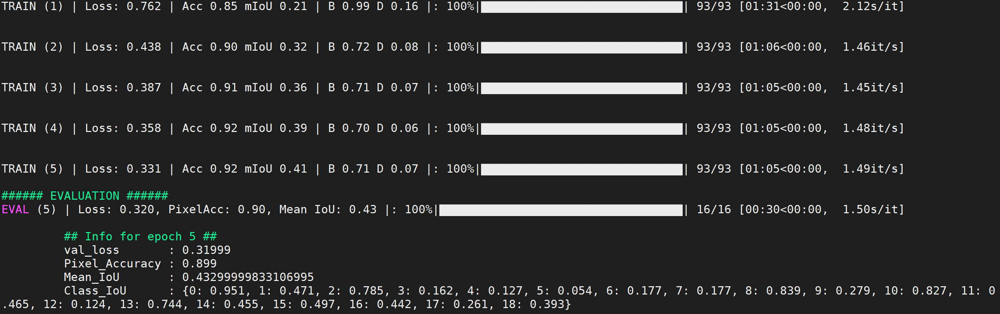

  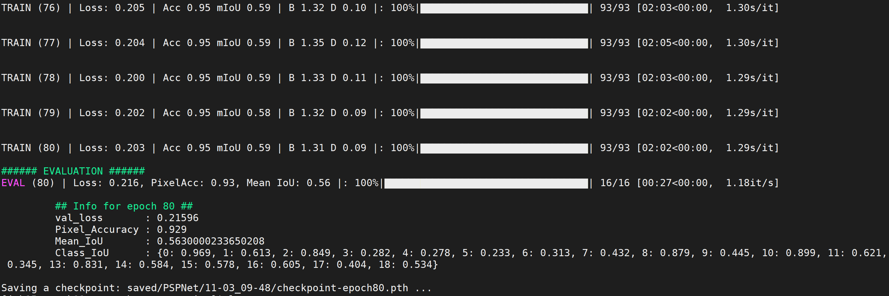

The mIoU is not very perfect as the top model in CityScapes ranking reaches over 80%. The reasons may lie in that I only trained 80 epoches needing only 3.5 hrs with 3 V100 GPUs on SCC and our model only have 50 layers while top models may have hundreds with fancy optimizations. But we don't need such a high mIoU to precisely discribe the shape of object. Our aim is to know the background type.

  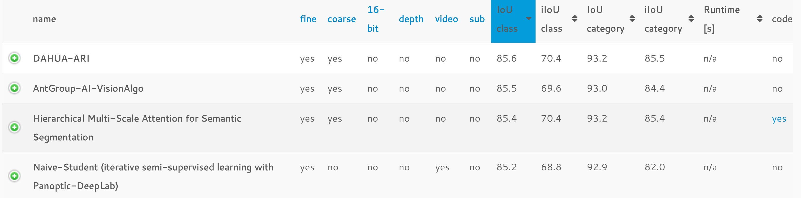

### Trained Model:

| Backbone     | CityScapes val mIoU | CityScapes accuracy | Pretrained Model |
| :----------: |:-----------------: |:-------------------:|:----------------:|
| ResNet 50 + CRF   | 56%                | 93%                 | [Dropbox](https://www.dropbox.com/s/qac5r3n0na69s9g/best_model.pth?dl=0) |

### Identify the background
There are three principles for me to identify the background type.
1. Focus on the edge parts of images, don't care about the central area (1/4<row<3/4 and 1/4<col<3/4)
2. Find the two classes that occupy most pixels
3. If the biggest class occupies far more areas than the second, output the biggest one, else output both of them.

  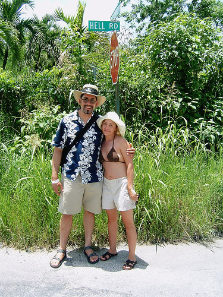
  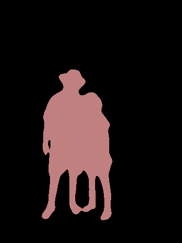
  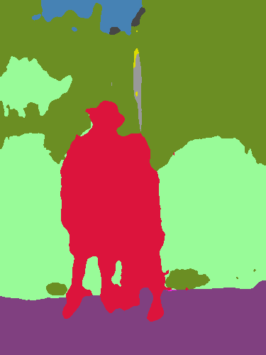

Image in the middle is PSPNet, a classical sementic segmentation algorithm trained on Pascal VOC. Image on the right is our model's result. The way classical sementic segmentation recognize object is defining other things unlabelled. But we can't do that as we need to know its type.

### Results

  
  
  
  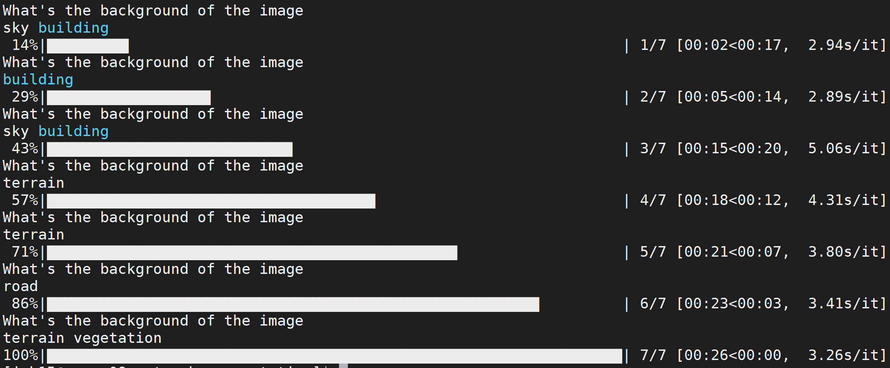

  
  

  
  

  
  

  
  

  
  

  
  

Terrain class is referred as grassy terrain, as there is no grass class defined. We have to admit that there do exist some mistakes in the results and our model still need further improving. But we think that we basically achieved the MVP of our project.

## Sprint 4
1. Expand number of classes (not sure if we can do that)
2. Expand the type of questions
3. Try to improve our model to get better performance
