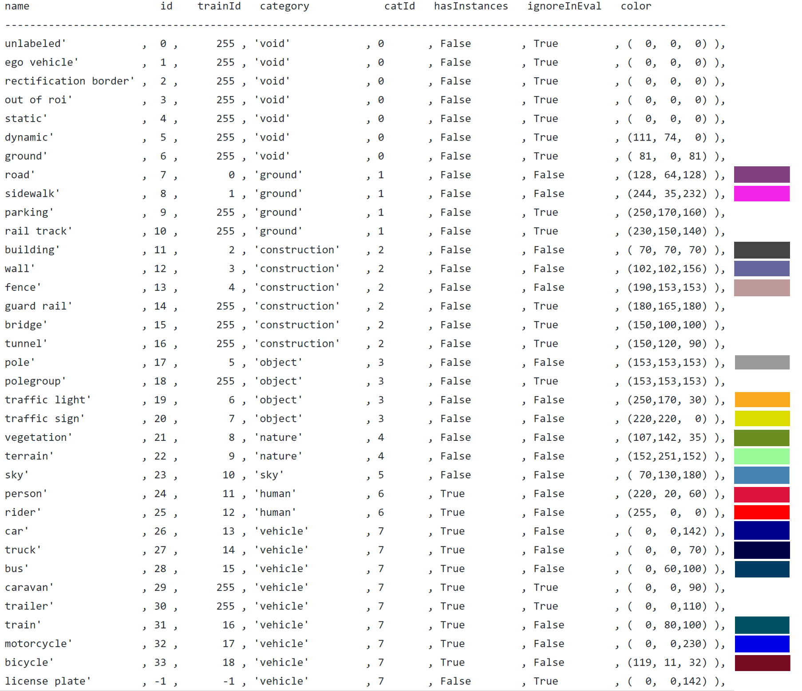

# Sprint3
## Image processing
### Building our own model
I used [CityScapes dataset](https://www.cityscapes-dataset.com/downloads/) to train the model, which use ResNet-50 as backbone combined with CRF. I choose CityScapes dataset as this dataset is made up of images from different cities, which matches our aim most. We can still use it in sprint4 to tell in which city the images are. Then I use our dataset to finetune the model. I don't use our dataset to train our model directly as our dataset don't have annotations. 

  

I only use 19 classes out of 35 classes defined in CityScapes as our model don't have very complicated structure and there isn't too many parameters. So a lot of classes may lead to accuracy loss and low performance.

  

  

  

The mIoU is not very perfect as the top model in CityScapes ranking reaches over 80%. The reasons may lie in that I only trained 80 epoches needing only 3.5 hrs with 3 V100 GPUs on SCC and our model only have 50 layers while top models may have hundreds with fancy optimizations. But we don't need such a high mIoU to precisely discribe the shape of object. Our aim is to know the background type.

  

### Trained Model:

| Backbone     | CityScapes val mIoU | CityScapes accuracy | Pretrained Model |
| :----------: |:-----------------: |:-------------------:|:----------------:|
| ResNet 50 + CRF   | 56%                | 93%                 | [Dropbox](https://www.dropbox.com/s/qac5r3n0na69s9g/best_model.pth?dl=0) |

### Identify the background
There are three principles for me to identify the background type.
1. Focus on the edge parts of images, don't care about the central area (1/4<row<3/4 and 1/4<col<3/4)
2. Find the two classes that occupy most pixels
3. If the biggest class occupies far more areas than the second, output the biggest one, else output both of them.

  
  
  

