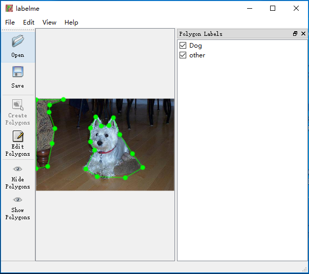

# Sprint4
## Dataset
In sprint4, our purpose is to recognize some famous tourist spots around the world. 
In sprint3, the dataset we make didn’t perform well when we using it to train our model. At that time, we actually use a semantic segmentation dataset to train our model and then use the dataset we made to test it. 
So, this time, we try to follow the format of the semantic segmentation dataset we used before to build the new dataset.
We choose to download the labelme to label our images. 

  

For example, we choose the Great Wall, pyramid and the Eiffel Tower to build our dataset.

  

  

  

