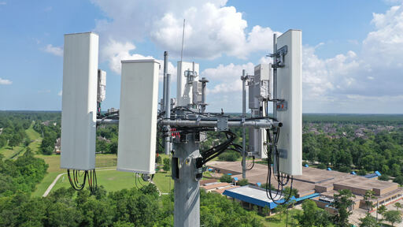
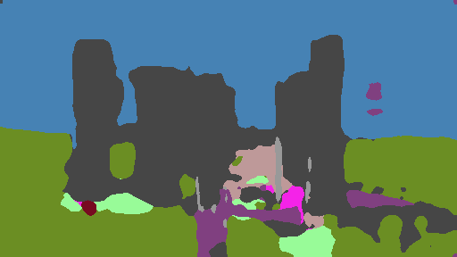
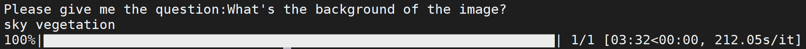
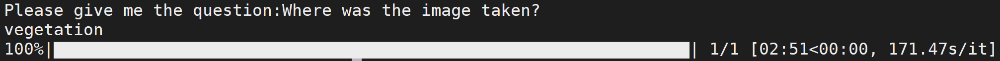
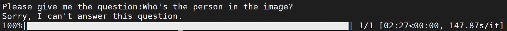
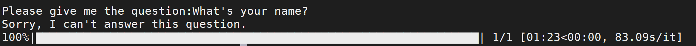

# Sprint4
## Dataset
In sprint4, our purpose is to recognize some famous tourist spots around the world. 
In sprint3, the dataset we make didn’t perform well when we using it to train our model. At that time, we actually use a semantic segmentation dataset to train our model and then use the dataset we made to test it. 
So, this time, we try to follow the format of the semantic segmentation dataset we used before to build the new dataset.
We choose to download the labelme to label our images. 

  

For example, we choose the Great Wall, pyramid and the Eiffel Tower to build our dataset.

  

  

  

## Model
### Expand the range of question
In sprint 4 the first thing we did was expand the range of question. In sprint 3 we only used one question,'What's the background of image?'. Though background-related question is limited, there are still some questions that apply. Unlike traditional VQA algorithms which use element-wise add or multiplication to combine the features from question and image, I use a if-else statement structure which divided the output of question into three bins. I transforms the output of question after LSTM into background-related scores.

  
  

  

  

  

  

### Improve the performance
| Backbone     | CityScapes val mIoU | CityScapes accuracy | Pretrained Model |
| :----------: |:-----------------: |:-------------------:|:----------------:|
| ResNet 50 + CRF   | 60%                | 95%                 | [Dropbox](https://www.dropbox.com/s/qac5r3n0na69s9g/best_model.pth?dl) |
