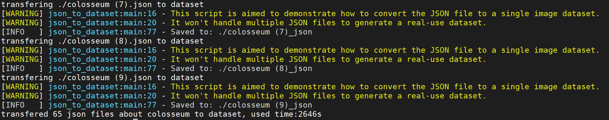

# Sprint5
## Dataset
In Sprint5, our purpose is to finish our dataset. Using Labelme to label our images so that to build our own dataset.

### Manaully label images
Here are the examples of our dataset. We have finished the Eiffel Tower, the Great Wall, colosseum and pyramid types.
<p align="left">
  
  
  
  
</p>

Here are the examples of our dataset which are labeled. 
<p align="center">
  
</p>

<p align="center">
  
</p>

<p align="center">
  
</p>

<p align="center">
  
</p>

 We colllected over one thousand images from internet and labeled all of them. And atter saving them, a json file corresponding to the changed picture will be generated.
 
 <p align="left">
  
</p>


### Generate the dataset
In order to run the json file, I wrote a batch file to execute labelme_json_to_dataset.py

```python
now=`date +'%Y-%m-%d %H:%M:%S'`
start_time=$(date --date="$now" +%s);
c=0
echo "Now begin to search json file..."
cd ./greatwall
for file in ./*
do
    if [ "${file##*.}"x = "json"x ]
    then
    echo "transfering $file to dataset"
    labelme_json_to_dataset "$file"
    c=`expr $c + 1`
    fi
#    printf "no!\n "
done
now=`date +'%Y-%m-%d %H:%M:%S'`
end_time=$(date --date="$now" +%s);
echo "transfered $c json files about greatwall to dataset, used time:"$((end_time-start_time))"s"
```

The result of execution will generate a folder corresponding to the picture, which includes four files: img, info, label, label_viz

<p align="left">
  
</p>

<p align="left">
  
</p>

<p align="left">
  
</p>

<p align="center">
  
  
  
</p>

<p align="center">
  
  
  
</p>

<p align="center">
  
  
  
</p>

<p align="center">
  
  
  
</p>

Another step is needed to extract label.png file from single \_json directory. I wrote a [python script](extract.py) to extract and rename the file.

<p align="left">
  
</p>

<p align="left">
  
</p>
