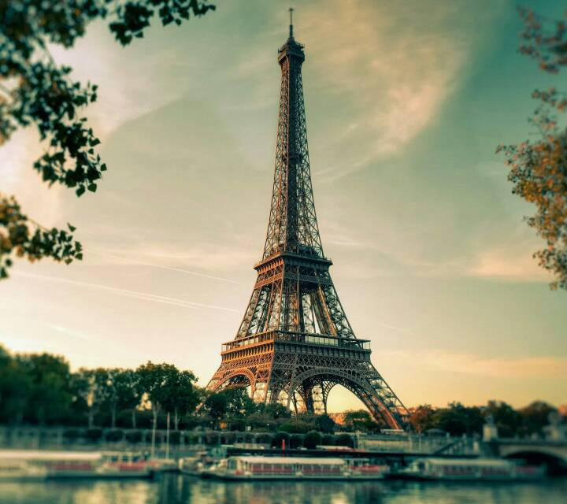

# Sprint5
## Dataset
In Sprint5, our purpose is to finish our dataset. Using Labelme to label our images so that to build our own dataset.

### Manaully label images
Here are the examples of our dataset. We choose the Eiffel Tower, the Great Wall, colosseum and pyramid

  
  
  
  

Here are the examples of our dataset which are labeled. 

  

  

  

  

 We colllected over one thousand images from internet and labeled all of them. And atter saving them, a json file corresponding to the changed picture will be generated.
 
 

  

### generate the dataset

  
  
  

  
  
  

  
  
  

